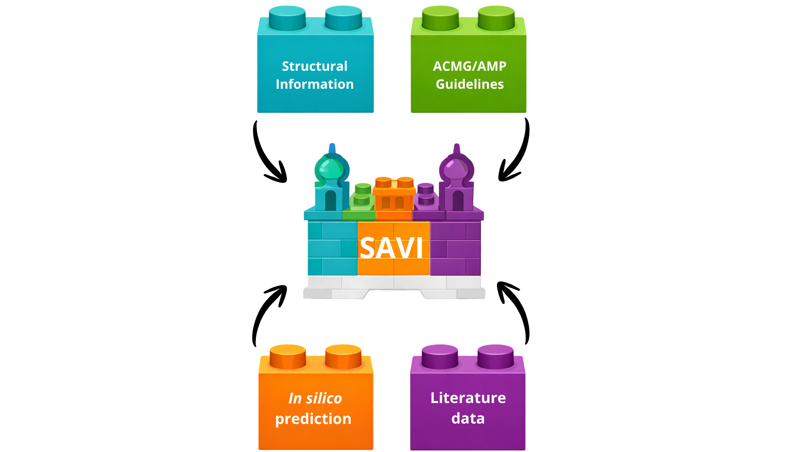

# SAVI
## Structure Assisted Variant Interpretation

  

**SAVI** is a platform designed to support the interpretation of missense genetic variants. It provides comprehensive tools and insights to help researchers and clinicians better understand the potential impact of variants of uncertain significance.

The platform is freely accessible to all users — including for commercial use — promoting collaboration and innovation in genomic research.

🔗 **Access SAVI:** https://mcosta27.shinyapps.io/shiny63/
