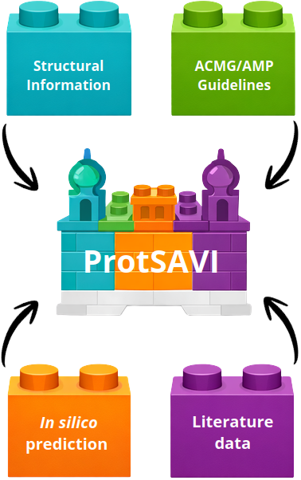

# ProtSAVI

  

**ProtSAVI** (Protein Structure-Assisted Variant Interpretation) is an R-based dashboard that offers a transparent, user-friendly framework for variant interpretation and classification. The tool integrates ACMG/AMP criteria, literature data, functional annotations, in silico predictions, and structural analyses to interpret and reclassify genetic variants.

The increasing number of Variants of Uncertain Significance (VUS) poses a major challenge for clinicians, researchers, and patients. Re-interpretation of these variants can substantially influence diagnostic outcomes for individuals with inconclusive results. By integrating structural biophysical analyses, AI-driven predictions, and functional data on target gene-encoded proteins, we seek to provide actionable insights for variant interpretation.

🔗 **Access ProtSAVI:** https://mcosta27.shinyapps.io/SAVI

To explore the platform, please use the input examples provided in this repository. For each gene available in the dashboard, we include variants classified as VUS according to ClinVar.

## Running ProtSAVI locally

To run **ProtSAVI** locally, you need to have **R** and **RStudio** installed, along with the package versions listed below.

1. Clone this repository or download it as a ZIP file.
2. Open the project in **RStudio**.
3. Install the required packages (see table below).
4. Run the `ProtSAVI_v2.R` script to launch the application.

### Required package versions

ProtSAVI was developed and tested using the following package versions:

| Package | Version |
|----------|---------|
| here | 1.0.1 |
| rio | 1.2.3 |
| tidyverse | 2.0.0 |
| readr | 2.1.4 |
| stringr | 1.5.1 |
| colorspace | 2.1.0 |
| shiny | 1.8.1.1 |
| shinyWidgets | 0.8.6 |
| DT | 0.28 |
| NGLVieweR | 1.3.4 |
| plotly | 4.12.0 |
| shinyjs | 2.1.0 |
| bslib | 0.7.0 |
| ggplot2 | 3.5.1 |

## Development Team

**Mauricio G. S. Costa**  
Programa de Computação Científica (PROCC) – Fundação Oswaldo Cruz (Fiocruz)  
Vice-Presidência de Educação, Informação e Comunicação (VPEIC) – Fundação Oswaldo Cruz (Fiocruz)  
ORCID: https://orcid.org/0000-0001-5443-286X  
Email: mauricio.costa@fiocruz.br  

**Nathalia P. D. Nigro**  
Mestranda em Biologia Computacional e Sistemas – Instituto Oswaldo Cruz (IOC), Fundação Oswaldo Cruz (Fiocruz)  
Programa de Computação Científica (PROCC) – Fundação Oswaldo Cruz (Fiocruz)  
ORCID: https://orcid.org/0009-0004-4213-5672  
Email: nathaliapdnigro@gmail.com  

**Paula F. C. Franklin**  
Doutoranda em Biologia Computacional e Sistemas – Instituto Oswaldo Cruz (IOC), Fundação Oswaldo Cruz (Fiocruz)  
Programa de Computação Científica (PROCC) – Fundação Oswaldo Cruz (Fiocruz)  
ORCID: https://orcid.org/0009-0008-7481-1689  
Email: paulafcfranklin@gmail.com  

**Prof. Roberta Soares Faccion**  
Instituto de Biofísica Carlos Chagas Filho – Universidade Federal do Rio de Janeiro (UFRJ)  
ORCID: https://orcid.org/0000-0002-9502-0324  
Email: robsfaccion@gmail.com  

**Zilton F. M. Vasconcelos**  
Laboratório de Alta Complexidade – Instituto Fernandes Figueira (IFF), Fundação Oswaldo Cruz (Fiocruz)  
ORCID: https://orcid.org/0000-0002-2193-2224  
Email: zilton.vasconcelos@fiocruz.br  

